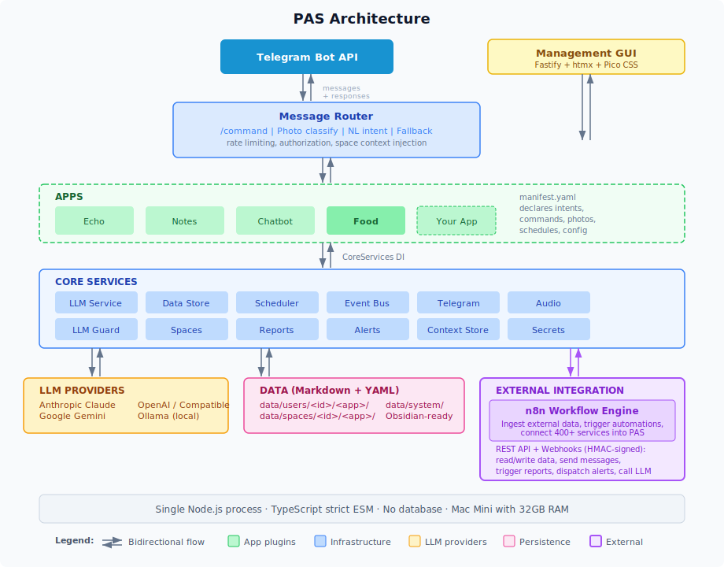

# Personal Automation System (PAS)

A local-first home automation platform built on scope-isolated app plugins, a single Telegram interface, manifest-driven contracts, and a markdown data layer compatible with Obsidian.

## Why this exists

Home automation platforms tend to fall into two camps: monoliths that centralize everything (losing isolation between capabilities) or fragmented app ecosystems (losing a unified interaction surface). PAS takes a middle path — apps are genuinely independent with their own data scopes and security boundaries, but users interact through a single Telegram bot. You get modularity without fragmentation.

## What's distinctive

Apps are loaded as TypeScript modules validated against a YAML manifest contract — they declare their intents, commands, schedules, and photo capabilities, and the infrastructure handles routing, cost tracking, and data isolation. All data is stored as markdown and YAML files on disk with no database, readable directly in Obsidian. External integrations are handled through n8n webhooks rather than per-app connectors. LLM access is multi-provider (Anthropic, Google Gemini, OpenAI, Ollama) with per-app rate limits and monthly cost caps. The whole system runs as a single Node.js process.



## Status

PAS is under active development. The core infrastructure is stable with over 4100 tests across 169 test files. Apps are in progress — a full-featured household food management app is complete. Currently running at household scale, shared publicly as a personal project with no production support offered.

## Features

- **Telegram bot interface** — send messages, commands, and photos to interact with your apps
- **AI-powered routing** — free-text messages are classified and routed to the right app automatically
- **Multi-provider LLM** — supports Anthropic Claude, Google Gemini, OpenAI, Ollama (local), and any OpenAI-compatible endpoint
- **Conversational AI fallback** — unmatched messages go to a built-in chatbot with conversation history and context awareness
- **App ecosystem** — scaffold new apps in minutes, share them as git repos, install with one command
- **Management GUI** — web dashboard for configuration, LLM model management, cost tracking, and data browsing
- **Scheduling** — cron jobs and one-off scheduled tasks declared in app manifests
- **Per-app cost controls** — rate limits and monthly cost caps enforced per app
- **Multi-user** — register multiple Telegram users with per-user app access and data isolation
- **Local-first** — runs on modest hardware (Mac Mini), all data stored as files on disk (no database)

## Quick Start

### Prerequisites

- **Node.js 22+** (see `.nvmrc`)
- **pnpm** (`npm install -g pnpm`)
- **Telegram account** — you'll create a bot via [@BotFather](https://t.me/BotFather)
- **Anthropic API key** — get one at [console.anthropic.com](https://console.anthropic.com)

### 1. Clone and install

```bash
git clone <repo-url>
cd personal-automation-system
pnpm install
```

### 2. Configure secrets

Copy the example environment file and fill in the three required values:

```bash
cp .env.example .env
```

Edit `.env` and set:

| Variable | Where to get it |
|----------|----------------|
| `TELEGRAM_BOT_TOKEN` | Create a bot with [@BotFather](https://t.me/BotFather) on Telegram |
| `ANTHROPIC_API_KEY` | [console.anthropic.com](https://console.anthropic.com) |
| `GUI_AUTH_TOKEN` | Generate a random string (e.g., `openssl rand -hex 32`) |

All other env vars are optional. See `.env.example` for the full list with descriptions.

### 3. Configure users

Copy the example config and add your Telegram user ID:

```bash
cp config/pas.yaml.example config/pas.yaml
```

Edit `config/pas.yaml` and replace `YOUR_TELEGRAM_USER_ID` with your actual Telegram user ID. To find your ID, message [@userinfobot](https://t.me/userinfobot) on Telegram.

### 4. Build and run

```bash
pnpm build
pnpm dev        # Local development (uses Telegram long polling, no tunnel needed)
```

Send a message to your bot on Telegram. If everything is configured correctly, the bot will respond.

The management GUI is available at `http://localhost:3000/gui` (log in with your `GUI_AUTH_TOKEN`).

## How Secrets Work

PAS keeps secrets separate from configuration so the repo can be shared freely:

- **`.env`** holds all API keys and tokens. It is gitignored and never committed. `.env.example` is the committed template.
- **`config/pas.yaml`** holds user configuration (Telegram user IDs, timezone, LLM settings). It is also gitignored. `config/pas.yaml.example` is the committed template.
- **Apps access external API keys** through `services.secrets.get(id)`. Apps declare what they need in their manifest under `requirements.external_apis`, specifying which environment variable holds the key. The infrastructure reads the env var and provides the value — apps never see `process.env` directly.

To add a new secret for an app, add the environment variable to your `.env` file and declare it in the app's `manifest.yaml`.

## Creating Apps

Apps are TypeScript modules that follow the `AppModule` interface. Each app has a `manifest.yaml` declaring its identity, capabilities, and requirements.

**Scaffold a new app:**

```bash
pnpm scaffold-app --name=my-app --description="My first app" --author="Your Name"
pnpm install    # Link the new workspace package
pnpm build
pnpm test
```

This generates a working app skeleton in `apps/my-app/` with manifest, source, and tests.

**Documentation:**

- [User Guide](docs/USER_GUIDE.md) — how to interact with PAS as an end user
- [Creating an App](docs/CREATING_AN_APP.md) — step-by-step developer guide
- [Manifest Reference](docs/MANIFEST_REFERENCE.md) — complete field reference for `manifest.yaml`

**Example apps:**

| App | Description |
|-----|-------------|
| `apps/echo/` | Minimal example — echoes messages back (~30 lines) |
| `apps/notes/` | Practical example — save, list, and summarize notes. Demonstrates commands, intents, LLM, data storage, and user config |
| `apps/chatbot/` | Advanced example — conversational AI with context awareness, conversation history, and app metadata integration |
| `apps/food/` | Full-featured app — household food management with recipes, meal planning, grocery lists, photos, cooking guidance, and cost tracking |

**Installing shared apps:**

```bash
pnpm install-app <git-url>      # Clone, validate, and install an app from a git repo
pnpm uninstall-app <app-id>     # Remove an installed app
```

## Deployment

### Local development

```bash
pnpm dev
```

Uses Telegram long polling — no tunnel or public URL needed. The bot connects directly to Telegram's servers.

### Docker

```bash
docker compose up               # Production: core + Ollama, no exposed ports
docker compose up -d             # Detached mode
```

For development with hot reload:

```bash
docker compose -f docker-compose.yml -f docker-compose.dev.yml up
```

### Production with Cloudflare Tunnel

For a public-facing bot with HTTPS webhook:

1. Set `WEBHOOK_URL` in `.env` to your public URL (e.g., `https://your-domain.com/webhook/telegram`)
2. Set `CLOUDFLARE_TUNNEL_TOKEN` in `.env`
3. Set `TRUST_PROXY=true` in `.env`
4. Run with Docker Compose (ports are not exposed — traffic goes through the tunnel)

## Project Structure

```
apps/                    # App plugins (each has manifest.yaml + src/)
  echo/                  # Minimal example app
  notes/                 # Practical example app
  chatbot/               # Built-in conversational AI fallback
  food/                  # Household food management app
config/
  pas.yaml.example       # System config template (users, timezone, LLM settings)
core/                    # Infrastructure package
  src/
    bootstrap.ts         # Composition root — wires everything together
    services/            # Router, LLM, data store, scheduler, etc.
    gui/                 # Management web interface (Fastify + htmx)
    types/               # TypeScript interfaces (AppModule, CoreServices)
    schemas/             # Manifest JSON Schema
docs/
  CREATING_AN_APP.md     # App developer guide
  MANIFEST_REFERENCE.md  # Manifest field reference
data/                    # Persistent data (gitignored, created at runtime)
```

## Architecture

PAS is a single-process Node.js application built with TypeScript (strict mode, ESM only). Apps are loaded as modules and receive infrastructure services via dependency injection — they never import LLM SDKs or access the filesystem directly. The infrastructure provides message routing, LLM access with cost tracking, scoped data storage, scheduling, and a management GUI. All data is stored as markdown and YAML files on disk (no database).

For full architecture details, see `CLAUDE.md`.

## Available Scripts

| Script | Description |
|--------|-------------|
| `pnpm dev` | Start in development mode (tsx watch + long polling) |
| `pnpm build` | Compile TypeScript for all packages |
| `pnpm test` | Run all tests (Vitest) |
| `pnpm lint` | Check code style (Biome) |
| `pnpm scaffold-app --name=<id>` | Generate a new app skeleton |
| `pnpm install-app <git-url>` | Install a shared app from a git repo |
| `pnpm uninstall-app <app-id>` | Remove an installed app |
| `pnpm register-app --name=<id>` | Validate manifest and update app registry |

## License

MIT
