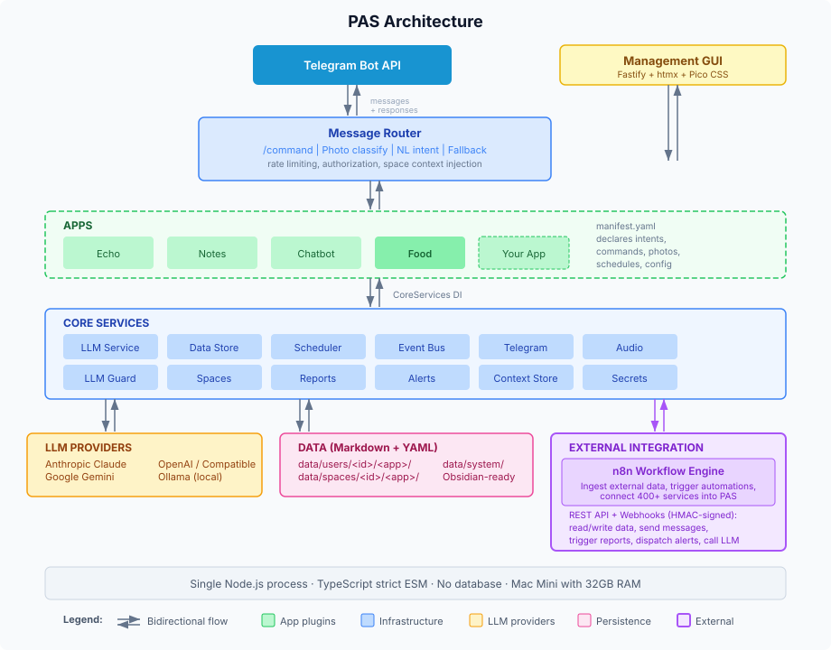

# Personal Automation System (PAS)

A local-first home automation platform built on scope-isolated app plugins, a single Telegram interface, manifest-driven contracts, and a markdown data layer compatible with Obsidian.

## Why this exists

Home automation platforms tend to fall into two camps: monoliths that centralize everything (losing isolation between capabilities) or fragmented app ecosystems (losing a unified interaction surface). PAS takes a middle path — apps are genuinely independent with their own data scopes and security boundaries, but users interact through a single Telegram bot. You get modularity without fragmentation.

## What's distinctive

Apps are loaded as TypeScript modules validated against a YAML manifest contract — they declare their intents, commands, schedules, photos, rules, and events, and the infrastructure handles routing, cost tracking, and data isolation. Apps never import LLM SDKs or touch the filesystem directly; install-time static analysis enforces that. Free-text messages flow through a routing priority — exact `/command` match, then photo classification, then LLM intent classification, then a conversational chatbot fallback. Canonical data is stored as markdown and YAML files on disk, readable directly in Obsidian; a derived SQLite/FTS index powers full-text recall and is rebuildable from the files at any time. External integrations are handled through n8n webhooks and a REST API rather than per-app connectors. LLM access is multi-provider (Anthropic, Google Gemini, OpenAI-compatible, Ollama) with tier-based routing and per-app rate limits and cost caps. The whole system runs as a single Node.js process and is multi-user, with per-user data isolation.



## Status

PAS is under active development. The core infrastructure is stable, with a large Vitest suite (several thousand tests) plus a separate real-LLM regression suite. Apps are in progress — a full-featured household food management app is complete. Currently running at household scale, shared publicly as a personal project with no production support offered.

## Features

- **Telegram bot interface** — send messages, commands, and photos to interact with your apps
- **AI-powered routing** — free-text messages are classified and routed to the right app automatically, with grey-zone verification
- **Multi-provider LLM** — Anthropic Claude, Google Gemini, Ollama (local), and any OpenAI-compatible endpoint, with tier-based routing (`fast` / `standard` / `reasoning`)
- **Conversational AI fallback** — unmatched messages go to a built-in chatbot with long-term memory (see [Long-Term Memory](#long-term-memory-hermes) below)
- **App ecosystem** — scaffold new apps in minutes, share them as git repos, install with one command
- **Reports & alerts** — user-defined recurring reports and condition-evaluated alerts with multiple action types (Telegram, webhook, audio, run-report, write-data)
- **Management GUI** — web dashboard for configuration, LLM model management, cost tracking, settings, data browsing, and the regression test runner
- **Scheduling** — cron jobs and one-off scheduled tasks declared in app manifests
- **External REST API & n8n** — read/write app data over HTTP; cron triggers can dispatch to n8n; outbound webhooks on data changes
- **Spaces & households** — named shared-data membership groups and multi-user household scoping
- **Audio output** — text-to-speech via Piper, optionally cast to Chromecast
- **Per-app cost controls** — rate limits and monthly cost caps enforced per app and per household
- **Multi-user** — register multiple Telegram users with per-user app access and data isolation
- **Local-first** — runs on modest hardware (Mac Mini); canonical data is plain files on disk (the SQLite/FTS index is derived and rebuildable)

## Quick Start

### Prerequisites

- **Node.js 22+** (see `.nvmrc`)
- **pnpm 10+** (`npm install -g pnpm`)
- **Telegram account** — you'll create a bot via [@BotFather](https://t.me/BotFather)
- **At least one LLM provider** — Anthropic, Google Gemini, any OpenAI-compatible endpoint, or a local Ollama install. Anthropic is the simplest default — get a key at [console.anthropic.com](https://console.anthropic.com).

### 1. Clone and install

```bash
git clone <repo-url>
cd personal-automation-system
pnpm install
```

### 2. Configure secrets

Copy the example environment file and fill in the three required values:

```bash
cp .env.example .env
```

Edit `.env` and set:

| Variable | Where to get it |
|----------|----------------|
| `TELEGRAM_BOT_TOKEN` | Create a bot with [@BotFather](https://t.me/BotFather) on Telegram |
| `ANTHROPIC_API_KEY` | [console.anthropic.com](https://console.anthropic.com) — or configure a different provider (`GOOGLE_AI_API_KEY`, `OPENAI_API_KEY` + `OPENAI_BASE_URL`, or `OLLAMA_URL`) |
| `GUI_AUTH_TOKEN` | Generate a random string (e.g., `openssl rand -hex 32`). Used for first-run/admin bootstrap of the management GUI — see [GUI access](#4-build-and-run) below |

All other env vars are optional. See `.env.example` for the full list with descriptions, including the other LLM provider keys.

### 3. Configure users

Copy the example config and add your Telegram user ID:

```bash
cp config/pas.yaml.example config/pas.yaml
```

Edit `config/pas.yaml` and replace `YOUR_TELEGRAM_USER_ID` with your actual Telegram user ID. To find your ID, message [@userinfobot](https://t.me/userinfobot) on Telegram.

### 4. Build and run

```bash
pnpm build
pnpm dev        # Local development (uses Telegram long polling, no tunnel needed)
```

Send a message to your bot on Telegram. If everything is configured correctly, the bot will respond.

The management GUI is available at `http://localhost:3000/gui`. Normal login is your Telegram user ID plus a password — set one with `pnpm auth:set-password`. The `GUI_AUTH_TOKEN` from `.env` is a bootstrap/recovery path: it is accepted only when exactly one admin user exists, so you can reach the GUI before any password is set.

## How Secrets Work

PAS keeps secrets separate from configuration so the repo can be shared freely:

- **`.env`** holds all API keys and tokens. It is gitignored and never committed. `.env.example` is the committed template.
- **`config/pas.yaml`** holds user configuration (Telegram user IDs, timezone, LLM settings). It is also gitignored. `config/pas.yaml.example` is the committed template.
- **Apps access external API keys** through `services.secrets.get(id)`. Apps declare what they need in their manifest under `requirements.external_apis`, specifying which environment variable holds the key. The infrastructure reads the env var and provides the value — apps never see `process.env` directly.

To add a new secret for an app, add the environment variable to your `.env` file and declare it in the app's `manifest.yaml`.

## Creating Apps

Apps are TypeScript modules that follow the `AppModule` interface. Each app has a `manifest.yaml` declaring its identity, capabilities, and requirements.

**Scaffold a new app:**

```bash
pnpm scaffold-app --name=my-app --description="My first app" --author="Your Name"
pnpm install    # Link the new workspace package
pnpm build
pnpm test
```

This generates a working app skeleton in `apps/my-app/` with manifest, source, and tests.

**Documentation:**

- [User Guide](docs/USER_GUIDE.md) — how to interact with PAS as an end user
- [Creating an App](docs/CREATING_AN_APP.md) — step-by-step developer guide
- [Manifest Reference](docs/MANIFEST_REFERENCE.md) — complete field reference for `manifest.yaml`
- [Deployment](docs/DEPLOYMENT.md) — detailed deployment guide
- [Operations](docs/OPERATIONS.md) — running and maintaining a live instance
- [n8n Integration](docs/n8n-integration.md) — wiring PAS into n8n workflows

**Example apps:**

| App | Description |
|-----|-------------|
| `apps/echo/` | Minimal example — echoes messages back (~30 lines) |
| `apps/notes/` | Practical example — save, list, and summarize notes. Demonstrates commands, intents, LLM, data storage, and user config |
| `apps/food/` | Full-featured app — household food management with recipes, grocery lists, pantry tracking, photo (receipt) handling, scheduled jobs, and cost tracking |

The conversational AI fallback ("chatbot") is **not** an app — it is built into the infrastructure at `core/src/services/conversation/`.

**Installing shared apps:**

```bash
pnpm install-app <git-url>      # Clone, validate, and install an app from a git repo
pnpm uninstall-app <app-id>     # Remove an installed app
```

## Deployment

### Local development

```bash
pnpm dev
```

Uses Telegram long polling — no tunnel or public URL needed. The bot connects directly to Telegram's servers.

### Docker

```bash
docker compose up               # Production: core + Ollama, no exposed ports
docker compose up -d             # Detached mode
```

For development with hot reload:

```bash
docker compose -f docker-compose.yml -f docker-compose.dev.yml up
```

### Production with Cloudflare Tunnel

For a public-facing bot with HTTPS webhook:

1. Set `WEBHOOK_URL` in `.env` to your public URL (e.g., `https://your-domain.com/webhook/telegram`)
2. Set `CLOUDFLARE_TUNNEL_TOKEN` in `.env`
3. Set `TRUST_PROXY=true` in `.env`
4. Run with Docker Compose (ports are not exposed — traffic goes through the tunnel)

## Project Structure

```
apps/                    # App plugins (each has manifest.yaml + src/)
  echo/                  # Minimal example app
  notes/                 # Practical example app
  food/                  # Household food management app
config/
  pas.yaml.example       # System config template (users, timezone, LLM settings)
core/                    # Infrastructure package
  src/
    bootstrap.ts         # Composition root — wires everything together
    services/            # Router, LLM, data store, scheduler, conversation (chatbot), etc.
    gui/                 # Management web interface (Fastify + htmx)
    types/               # TypeScript interfaces (AppModule, CoreServices)
    schemas/             # Manifest JSON Schema
regression/              # Persona regression suite (separate pnpm workspace; see Testing below)
docs/
  CREATING_AN_APP.md     # App developer guide
  MANIFEST_REFERENCE.md  # Manifest field reference
data/                    # Persistent data (gitignored, created at runtime)
```

The conversational AI fallback is part of `core/src/services/conversation/`, not a separate app.

## Architecture

PAS is a single-process Node.js application built with TypeScript (strict mode, ESM only). Apps are loaded as modules and receive infrastructure services via dependency injection — they never import LLM SDKs or access the filesystem directly. The infrastructure provides message routing, multi-provider LLM access with cost tracking, scoped data storage, scheduling, reports and alerts, a REST API, and a management GUI. Canonical data is markdown and YAML files on disk; a derived SQLite/FTS index provides full-text recall and is rebuildable from those files at any time.

For full architecture details, see `CLAUDE.md`.

## Available Scripts

| Script | Description |
|--------|-------------|
| `pnpm dev` | Start in development mode (tsx watch + long polling) |
| `pnpm build` | Compile TypeScript for all packages |
| `pnpm test` | Run all tests (Vitest) |
| `pnpm test:watch` | Run the test suite in watch mode |
| `pnpm test:regression` | Run the persona regression suite (real LLM calls — see [Testing & Model Evaluation](#testing--model-evaluation)) |
| `pnpm typecheck:fixtures` | Type-check test fixtures |
| `pnpm lint` | Check code style (Biome) |
| `pnpm lint:fix` | Fix auto-fixable lint issues |
| `pnpm scaffold-app --name=<id>` | Generate a new app skeleton |
| `pnpm install-app <git-url>` | Install a shared app from a git repo |
| `pnpm uninstall-app <app-id>` | Remove an installed app |
| `pnpm auth:set-password` | Set a GUI login password for a user |
| `pnpm migrate-frontmatter` | One-time data migration for frontmatter format |
| `pnpm load-test` | Run the LLM load-test harness |
| `pnpm analyze-shadow-log` | Summarize shadow-classifier routing telemetry |
| `pnpm analyze-session-control-log` | Summarize session-control classifier telemetry |
| `pnpm chat-index-rebuild` | Rebuild the SQLite/FTS conversation index from transcripts |
| `pnpm chat-index-prune` | Prune the conversation index per the retention policy |

(`package.json` also defines `prepare`, an internal git-hook lifecycle script that runs automatically on `pnpm install` — not invoked directly.)

## Testing & Model Evaluation

Two separate test surfaces:

- **`pnpm test`** — the Vitest unit/integration suite. Runs offline, on every change, and gates every push. This is the suite app developers extend.
- **`pnpm test:regression`** — the **persona regression suite** in the `regression/` workspace: a fixture-backed, cached, real-LLM harness. It is deliberately excluded from `pnpm test` so it doesn't make API calls on every push.

The regression suite's purpose is **evidence-based model selection** — swap an LLM model and measure the accuracy delta before committing to it. It has four fixed buckets (`routing`, `receipt`, `chatbot`, `recall`), each running real classifiers/handlers and grading output with an oracle (a JSON-schema/assertion check, or an LLM judge).

```bash
pnpm test:regression                                         # all buckets, respects the cache
pnpm test:regression -- --dry-run                            # list cases + estimated cost, no LLM calls
pnpm test:regression -- --bucket=routing                     # one bucket
pnpm test:regression -- --model-matrix=ollama/gemma3:12b,anthropic/claude-sonnet-4-6
pnpm test:regression -- --judge-model=anthropic/claude-haiku-4-5
```

`--model-matrix` overrides the tier models (positional `fast,standard,reasoning` or named `tier=provider/model`); `--judge-model` overrides the LLM-judge oracle's model. The result cache key is **model-ID-aware**, so each model gets its own cached results and comparisons stay clean. A routing-accuracy gate (≥ 0.95 across food-routing inputs) makes the suite exit non-zero when a model regresses routing quality.

The `/gui/regression` admin page wraps this in a UI — a model-override form, a per-tier leaderboard, auto-generated weakness summaries, and performance-over-time charts. See [`regression/README.md`](regression/README.md) for full detail and [`docs/CREATING_AN_APP.md`](docs/CREATING_AN_APP.md#testing-model-behavior-with-the-regression-suite) for the app-developer perspective.

## Long-Term Memory (Hermes)

PAS maintains per-user long-term memory on the local filesystem — no external service required. This layer is called **Hermes**. Each conversation is a Markdown transcript; a derived SQLite + FTS5 index powers full-text recall across sessions.

### Layer model

The system prompt is assembled from six fenced layers on every turn:

| Layer | Source | Contents | Stability |
|---|---|---|---|
| 1 | Base prompt | Static persona, safety rules, capability overview | Static |
| 2 | Durable snapshot | ContextStore entries frozen at session-mint (`durable-memory` fence) | Frozen per-session |
| 3 | App + system context | Installed apps, schedule summaries, household config | Per-turn |
| 4 | Recalled data | App/DataQuery search results (`recalled-data` fence) | Per-turn |
| 5 | Recalled sessions | Past conversation excerpts found by FTS5, LLM-classified (`recalled-session` fence) | Per-turn |
| 6 | Live history | Current session turn pairs (up to 20 turns) | Per-turn |

### Persistence model

```
data/households/<householdId>/users/<userId>/chatbot/conversation/
  active-sessions.yaml           ← index: active session id + list of ended sessions
  sessions/
    <YYYYMMDD_HHMMSS_<8hex>>.md  ← per-session Markdown transcript (canonical)
data/system/chat-state.db        ← SQLite FTS5 derived index (rebuildable on demand)
```

Markdown transcripts are the authoritative source. The SQLite index is derived and rebuilt with `pnpm chat-index-rebuild`.

### Recall pipeline

| Path | How triggered | Output |
|---|---|---|
| **Auto (Layer 5)** | Every turn: pre-filter heuristic → fast-tier LLM classifier | Top-5 excerpts injected into prompt |
| **`/recall <query>`** | Explicit Telegram command | FTS5 hits displayed in chat (up to 5) |
| **`<session-search/>`** | LLM-self-issued pseudo-tool mid-response | Re-prompt with fenced search results |

### Snapshot lifecycle

- **Minted** at session start (`ensureActiveSession`): ContextStore entries are frozen and stored in session frontmatter — they don't change during the session even if you update preferences.
- **Rebuilt** explicitly via `/refreshmemory` (Telegram) or the GUI.
- **Flushed on idle reset** (opt-in via `flush_memory_on_idle_reset`): a fast-tier LLM summarizes the dying session and writes it to ContextStore under key `recent-session-summary`, which is pinned in the next session's Layer 2 snapshot.

### Typed memory and temporal recall

ContextStore entries carry a typed `kind:` field: `user-preference`, `communication-preference`, `environment-fact`, `project-convention`, or `household-policy`. The LLM can tag new facts with `<memory-kind-set kind="..."/>`. Session search supports temporal filters:

```
<session-search after="2026-04-01" before="2026-05-01"/>
```

Natural-language relative dates ("last week", "in March") are also understood by the recall classifier.

### Further reading

- FTS5 transcript search design: `docs/superpowers/specs/2026-04-28-hermes-p5-transcript-search-design.md`
- Memory snapshot design: `docs/superpowers/specs/2026-04-28-hermes-p4-memory-snapshot-design.md`
- Future memory enhancements (vector recall, RRF, supersession): `docs/open-items.md`

---

## Credits and Influences

| Resource | License | What we borrowed |
|---|---|---|
| [Vercel AI SDK (`ai`)](https://github.com/vercel/ai) | Apache 2.0 | Tool-call substrate: `ToolLoopAgent`, per-step cost reservation, `activeTools` preselection (chatbot-primary phase) |
| [asg017/sqlite-vec](https://github.com/asg017/sqlite-vec) | MIT | Local vector index virtual table for semantic recall (future) |
| [Mert Cobanov — memory.cobanov.dev](https://memory.cobanov.dev/) | (cited as influence) | Working/episodic/semantic/procedural memory taxonomy; RRF hybrid retrieval; HyDE; supersession governance |
| [Letta (formerly MemGPT)](https://github.com/letta-ai/letta) | Apache 2.0 | Self-editing memory + hierarchical context paging (informs snapshot rebuild and `<memory-kind-set>`) |
| [LangGraph](https://github.com/langchain-ai/langgraph) | MIT | Tool-loop checkpoint design concepts |
| [Anthropic MCP](https://modelcontextprotocol.io/) | MIT | Future: expose PAS apps as MCP servers or consume external MCP tools |

---

## License

MIT
